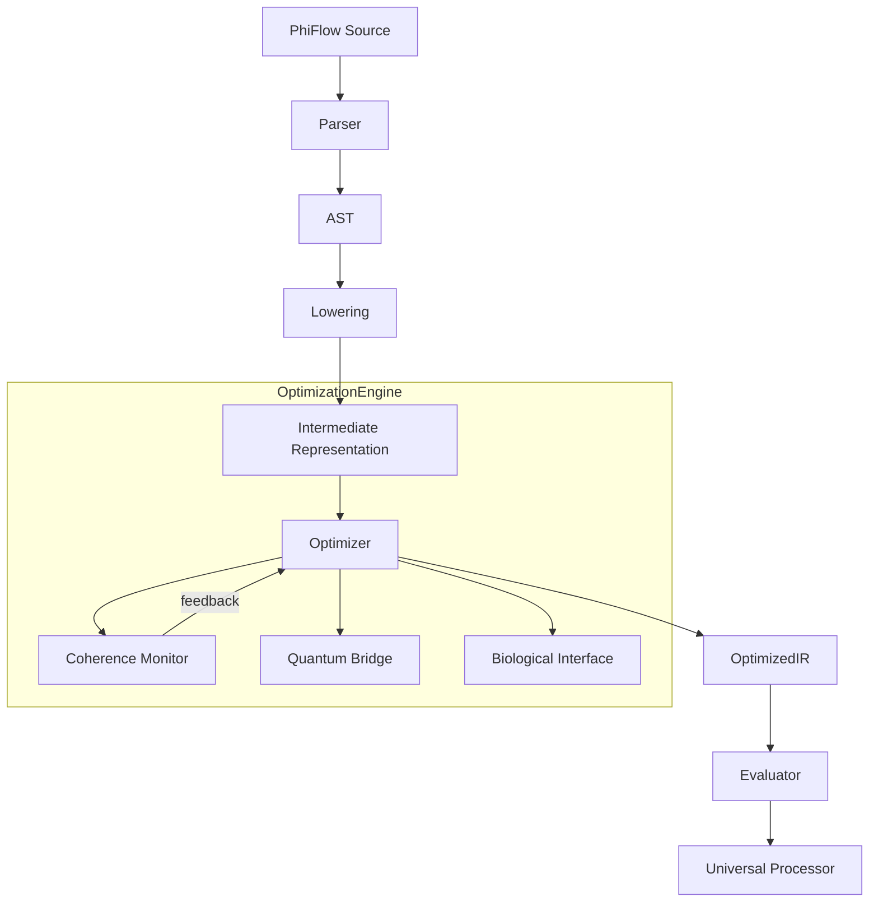

# PhiFlow Architecture: The Optimization Engine 🏗️

> **The Plan:** A multi-layered architecture bridging classical, quantum, and consciousness computing paradigms.

## 1. High-Level System Architecture

The Optimization Engine sits between the **PhiFlow Parser** and the **Execution Backend**. It transforms the initial AST into an optimized PhiIR based on cross-domain feedback.

## 2. Component Design

### 2.1. The Phi-Quantum Optimizer

* **Role:** Applies transformation passes to the PhiIR.
* **Input:** Raw PhiIR.
* **Output:** Optimized PhiIR.
* **Mechanism:** Multi-stage pipeline.
    1. **Linear Optimization:** Standard constant folding, DCE.
    2. **Phi-Harmonic Tuning:** Adjusts timing loops to Fibonacci intervals.
    3. **Quantum Superposition:** Identifying parallelizable blocks for quantum offload.
    4. **Consciousness Selection:** Choosing algorithms based on system intent ("Heal", "Create", "Analyze").

### 2.2. The Coherence Engine

* **Role:** Monitors system stability.
* **Metrics:**
  * `CpuJitter` (Classical perturbation)
  * `QubitDecoherence` (Quantum noise)
  * `BioFeedback` (User intent clarity)
* **Action:** Triggers "Healing" passes in the optimizer if coherence drops below threshold (e.g., < 95%).

### 2.3. The Universal Processor Interface

* **Role:** Abstract hardware abstraction layer.
* **Supported Paradigms:**
  * `Silicon`: Standard CPU/GPU (CUDA).
  * `Quantum`: QPU (IBM Qiskit via API).
  * `Neuromorphic`: Spiking Neural Networks (Intel Loihi).
  * `Biological`: DNA/Cell-based computation (Future).

## 3. Data Flow

1. **Ingest:** Source code is parsed into AST.
2. **Lower:** AST is lowered to SSA-based PhiIR.
3. **Witness:** The Optimizer "observes" the IR, calculating initial coherence.
4. **Resonate:** Optimization passes are applied based on the coherence score.
    * *High Coherence:* Aggressive, risky optimizations.
    * *Low Coherence:* Conservative, stabilizing optimizations.
5. **Execute:** The final IR is handed to the Evaluator or compiled to machine code.
